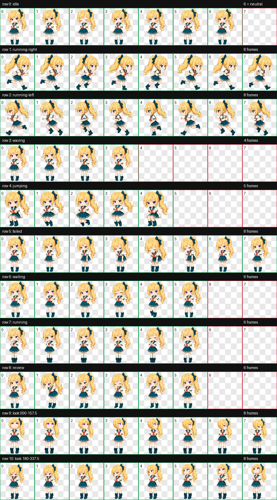
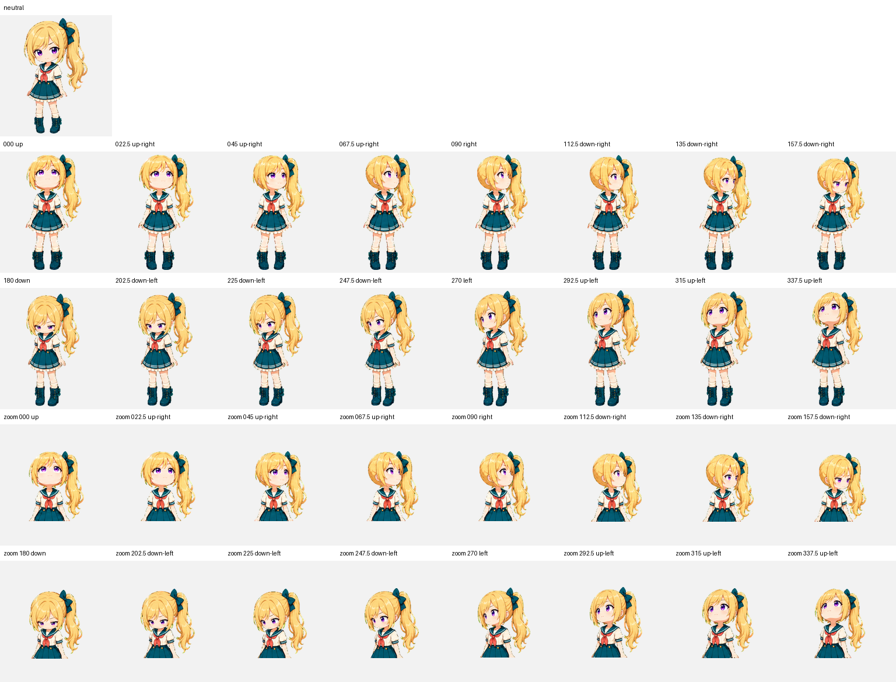

# Hina — Codex Animated Pet

<p align="center">
  
</p>

Hina is Miyu's slightly aloof but affectionate sister, with a golden-blonde high ponytail, deep-teal bow, violet eyes, and a cream-and-teal sailor-style outfit. She is packaged as a Codex sprite v2 pet with nine standard animation states and sixteen clockwise look directions.

히나는 미유의 자매로, 금발 하이 포니테일과 딥 틸 리본, 보라색 눈, 청록·크림 세라복, 살짝 새침하지만 다정한 표정이 특징입니다. Codex sprite v2 규격의 아홉 가지 기본 애니메이션과 열여섯 방향 시선을 지원합니다.

## Highlights

- Codex sprite contract: v2
- Atlas: `1536 × 2288` WebP with transparency
- Cell size: `192 × 208`
- Layout: 8 columns × 11 rows
- Standard states: idle, drag right, drag left, wave, jump, failed, waiting, working, review
- Look loop: 16 directions in 22.5-degree steps
- Public QA: atlas validation, three-reviewer blind direction validation, and independent final visual QA

## Animation previews

| Idle | Drag right | Drag left |
| --- | --- | --- |
|  |  |  |

| Wave | Jump | Failed |
| --- | --- | --- |
|  |  |  |

| Waiting for input | Working | Review |
| --- | --- | --- |
|  |  |  |

## Full sprite and look-direction previews

<details>
<summary>Open the complete 8 × 11 animation sheet</summary>



</details>

<details>
<summary>Open the neutral + 16-direction QA sheet</summary>



</details>

## Install

From the repository root on macOS or Linux:

```bash
mkdir -p "$HOME/.codex/pets/hina"
cp "Hina/pet.json" "$HOME/.codex/pets/hina/pet.json"
cp "Hina/spritesheet.webp" "$HOME/.codex/pets/hina/spritesheet.webp"
```

Restart or refresh the Codex desktop app if Hina does not appear immediately.

To uninstall:

```bash
rm -rf "$HOME/.codex/pets/hina"
```

## Required package files

Only these files are required by Codex:

```text
Hina/
├── pet.json
└── spritesheet.webp
```

The `previews`, `screenshots`, and `qa` folders are documentation and verification artifacts for repository visitors.

## Verification

The published package passed the following checks:

- `spriteVersionNumber: 2`
- WebP RGBA, `1536 × 2288`
- 8 columns × 11 rows
- Transparent RGB residue: 0 pixels
- Atlas errors and warnings: none
- Both cardinal blind-review gates passed by strict majority
- Two intermediate blind-review cues were marked subtle or ambiguous, then accepted by the labeled ordered-loop review
- All sixteen labeled look directions passed independent final visual review
- Published package and key screenshot checksums are listed in [`SHA256SUMS`](SHA256SUMS)

See [`qa/validation.json`](qa/validation.json), [`qa/direction-blind-validation.json`](qa/direction-blind-validation.json), and [`qa/final-visual-qa.json`](qa/final-visual-qa.json) for the public QA summaries.

## License

The package uses two licenses:

- `pet.json`, this README, `SHA256SUMS`, and files in `qa/` are available under the [MIT License](../LICENSES/MIT.txt).
- `spritesheet.webp`, images in `screenshots/`, and animations in `previews/` are available under [CC BY 4.0](../LICENSES/CC-BY-4.0.md).

When sharing or adapting Hina's visual assets, use this attribution where practical:

> Hina Codex Pet by Ryu JaeHyun, licensed under CC BY 4.0.

See the repository's [license overview](../LICENSE.md) for details.
