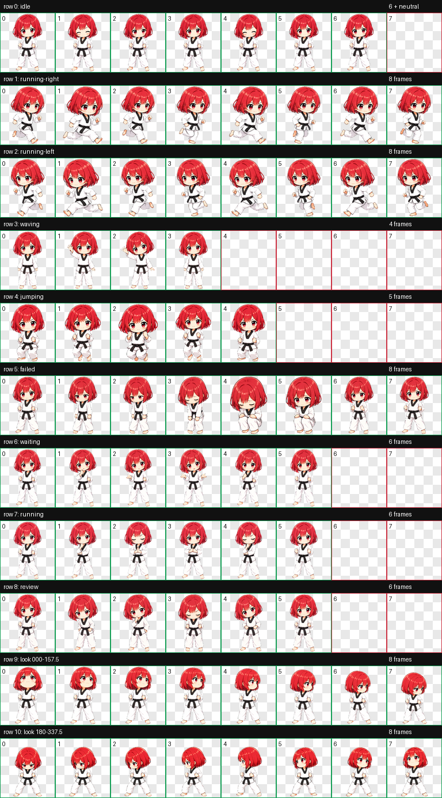
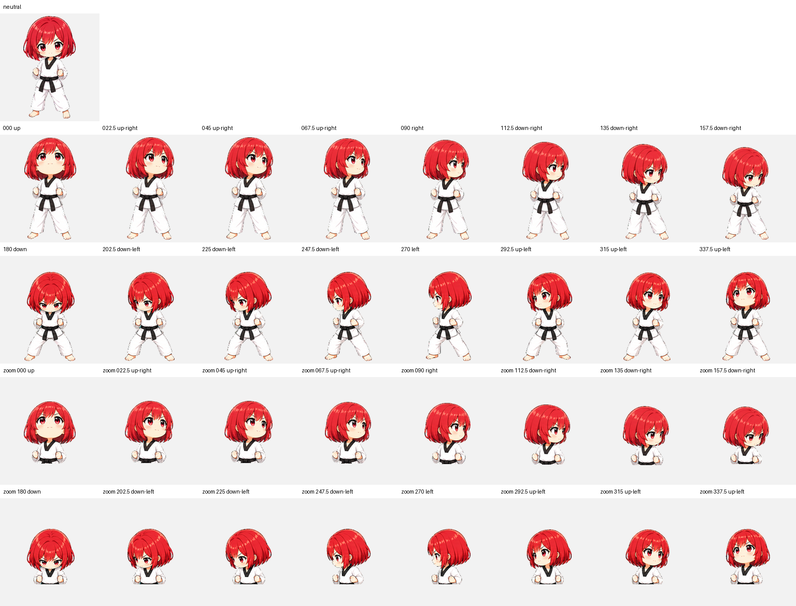

# Kana — Codex Animated Pet

<p align="center">
  
</p>

Kana is a determined yet irresistibly cute chibi taekwondo girl with a vivid red bob, amber-brown eyes, and a crisp white dobok. Her dark belt, red trim, guarded fists, and wide grounded stance express strong will while preserving the compact proportions and warm charm of the collection. She is packaged as a Codex sprite v2 pet with nine standard animation states and sixteen clockwise look directions.

카나는 선명한 붉은 단발과 호박빛 갈색 눈, 단정한 흰 태권도복이 특징인 의지 강한 치비 캐릭터입니다. 짙은 띠와 붉은 테두리, 단단히 쥔 주먹과 넓고 안정적인 자세로 강인함을 보여 주면서도 컬렉션 특유의 아담한 비율과 귀여움을 유지합니다. Codex sprite v2 규격의 아홉 가지 기본 애니메이션과 열여섯 방향 시선을 지원합니다.

## Highlights

- Codex sprite contract: v2
- Atlas: `1536 × 2288` WebP with transparency
- Cell size: `192 × 208`
- Layout: 8 columns × 11 rows
- Standard states: idle, drag right, drag left, wave, jump, failed, waiting, working, review
- Look loop: 16 directions in 22.5-degree steps
- Public QA: atlas validation, three-reviewer blind direction validation, and independent final visual QA

## Animation previews

| Idle | Drag right | Drag left |
| --- | --- | --- |
|  |  |  |

| Wave | Jump | Failed |
| --- | --- | --- |
|  |  |  |

| Waiting for input | Working | Review |
| --- | --- | --- |
|  |  |  |

## Full sprite and look-direction previews

<details>
<summary>Open the complete 8 × 11 animation sheet</summary>



</details>

<details>
<summary>Open the neutral + 16-direction QA sheet</summary>



</details>

## Install

From the repository root on macOS or Linux:

```bash
mkdir -p "$HOME/.codex/pets/kana"
cp "Kana/pet.json" "$HOME/.codex/pets/kana/pet.json"
cp "Kana/spritesheet.webp" "$HOME/.codex/pets/kana/spritesheet.webp"
```

Restart or refresh the Codex desktop app if Kana does not appear immediately.

To uninstall:

```bash
rm -rf "$HOME/.codex/pets/kana"
```

## Required package files

Only these files are required by Codex:

```text
Kana/
├── pet.json
└── spritesheet.webp
```

The `previews`, `screenshots`, and `qa` folders are documentation and verification artifacts for repository visitors.

## Verification

The published package passed the following checks:

- `spriteVersionNumber: 2`
- WebP RGBA, `1536 × 2288`
- 8 columns × 11 rows
- Transparent RGB residue: 0 pixels
- Atlas errors and warnings: none
- All fourteen blind direction pairs passed by strict three-reviewer majority with no warning or unconfirmed result
- All sixteen labeled look directions passed independent final visual review
- Continuity metric outliers were accepted after the ordered loop showed no visible stance reset, clipping, scale pop, center jump, identity break, or guard discontinuity
- Published package and key screenshot checksums are listed in [`SHA256SUMS`](SHA256SUMS)

See [`qa/validation.json`](qa/validation.json), [`qa/direction-blind-validation.json`](qa/direction-blind-validation.json), and [`qa/final-visual-qa.json`](qa/final-visual-qa.json) for the public QA summaries.

## License

The package uses two licenses:

- `pet.json`, this README, `SHA256SUMS`, and files in `qa/` are available under the [MIT License](../LICENSES/MIT.txt).
- `spritesheet.webp`, images in `screenshots/`, and animations in `previews/` are available under [CC BY 4.0](../LICENSES/CC-BY-4.0.md).

When sharing or adapting Kana's visual assets, use this attribution where practical:

> Kana Codex Pet by Ryu JaeHyun, licensed under CC BY 4.0.

See the repository's [license overview](../LICENSE.md) for details.
